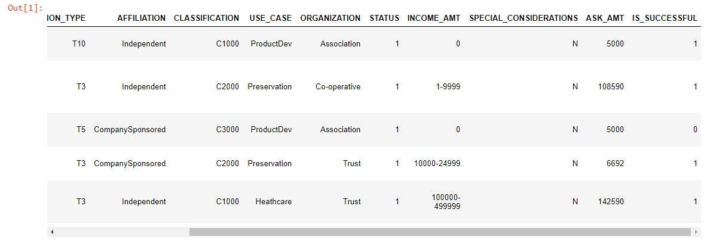
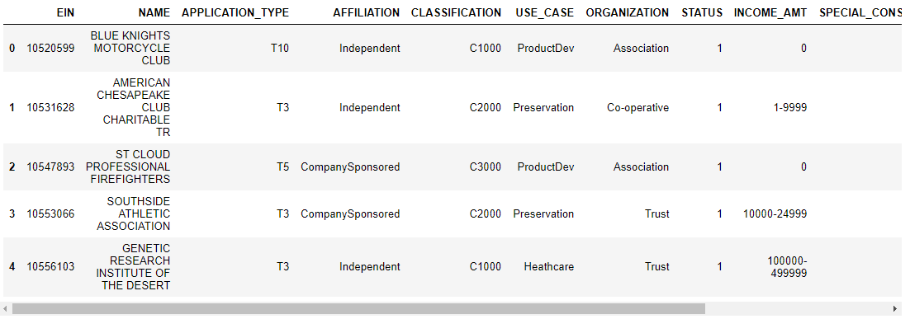
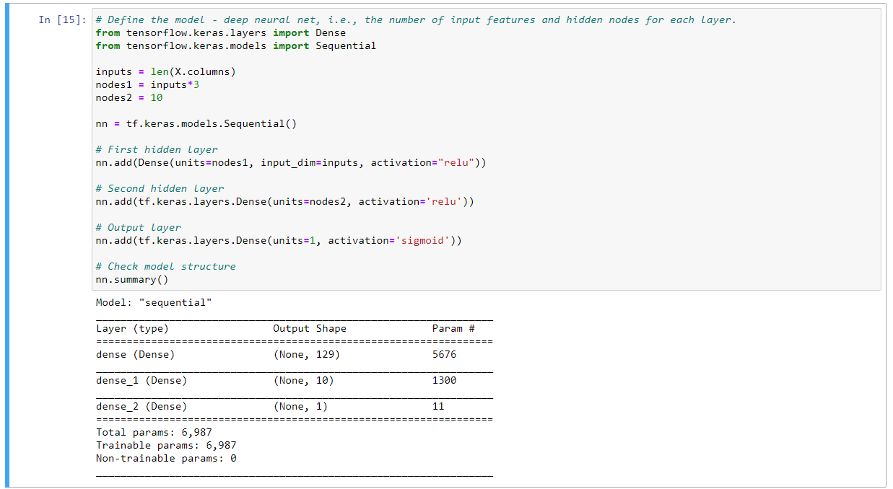
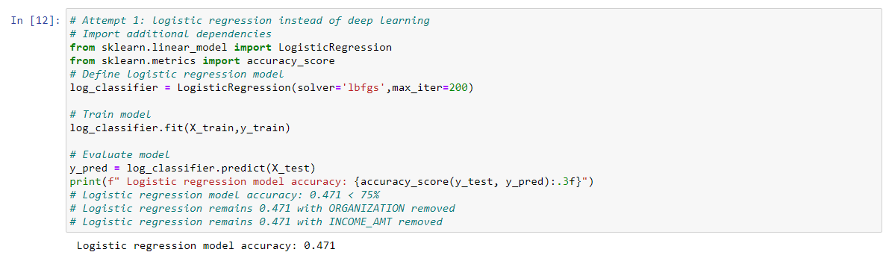
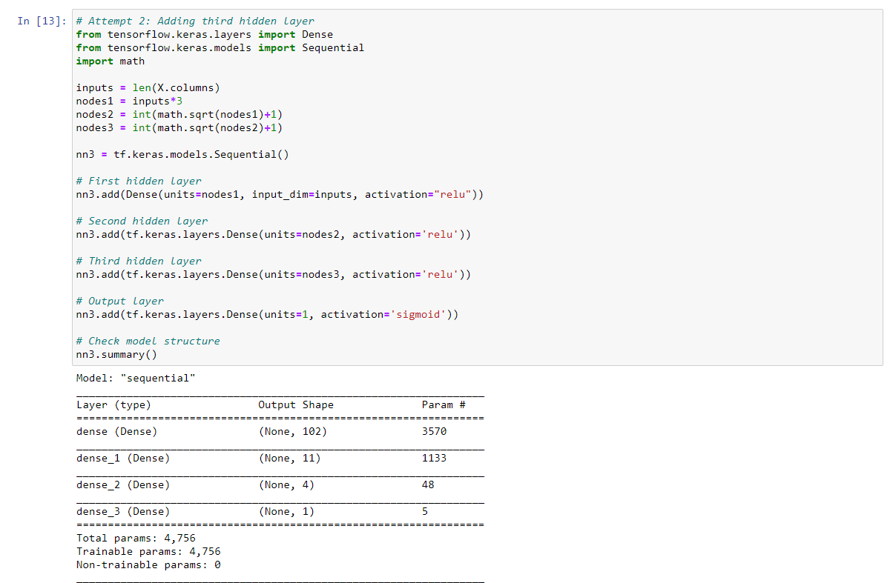
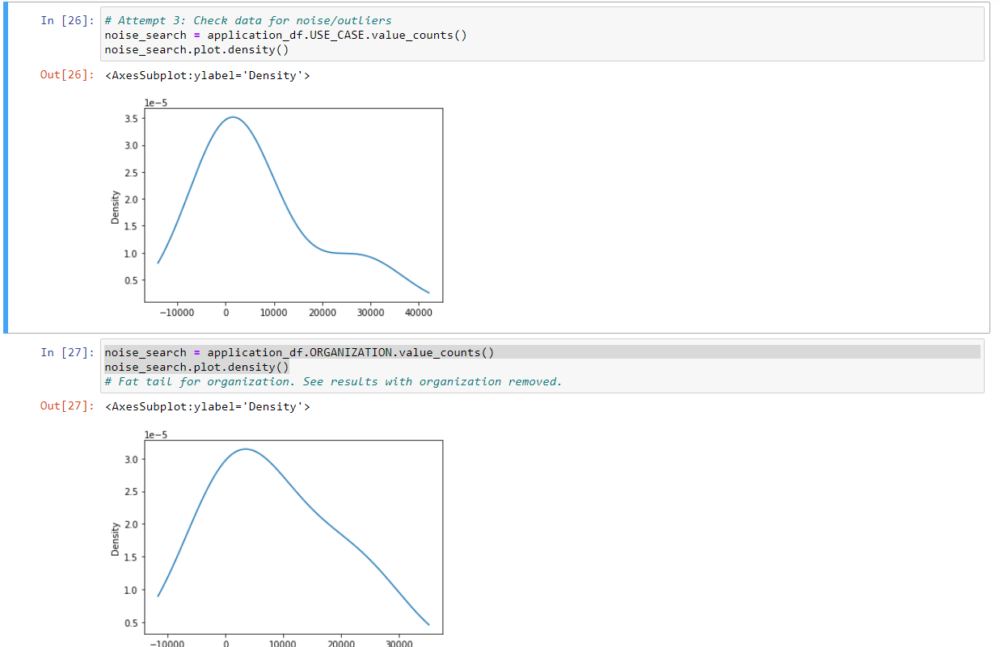
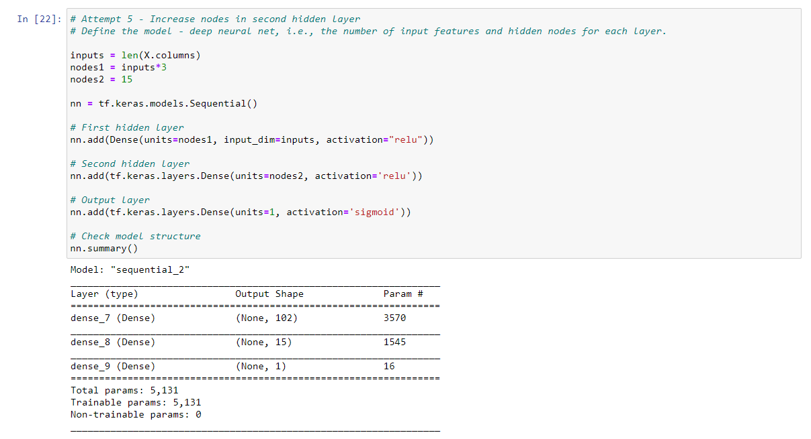
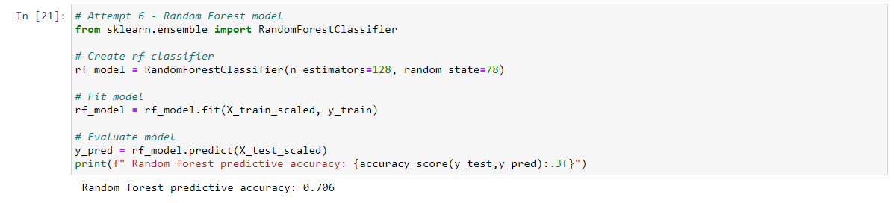
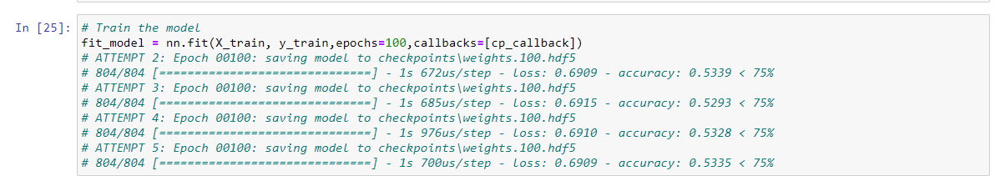

# Neural_Network_Charity_Analysis

This project analyzes the success of various philanthropic donations and the parties receiving the donations.

## Results

### Data Preprocessing

Before starting with the actual machine learning, the data needs to be converted to a state that the machine understands. Targets need to be separated from features, and information that does not point to any conclusions - either because each entry is unique, or each entry is the same - should be removed.

* The target of this analysis was the IS_SUCCESSFUL column, pictured below in teh original data

* The useless columns are EIN, and NAME, which are unique for each item and thus, not informative.

* The features, which will inform the machine learning process, are all of the other columns pictured above, though many will need further preprocessing (one-hot encoding) in order to to do so.

### Compiling, Training, and Evaluating the Model

Once the data is adequately processed, the machine can begin learning, through compiling and training. 

* The original neural network had two hidden layers, both with relu activation in expectation of various positive numbers and a nonlinear relationship. The first hidden layer had 129 nodes, three times the number of features being fed into the system. The second had 10.

* Despite various attempts, such as a logistic regression model,

* a third hidden layer in the neural network,

* removing a potentially problematic feature,

* increasing nodes in the original neural network,

* or trying a random forest model,

* the target model performance of 75% was not achieved.

## Summary

Despite several attempts, this model never achieved the target performance. Given the variety of attempts pursued, and that the best performance came from a much simpler random forest model, it is not recommended to pursue this calassification problem using a neural network, but rather using simpler machine learning algorithms, possibly VSM, and possibly include PCA in the preprocessing of the data.

